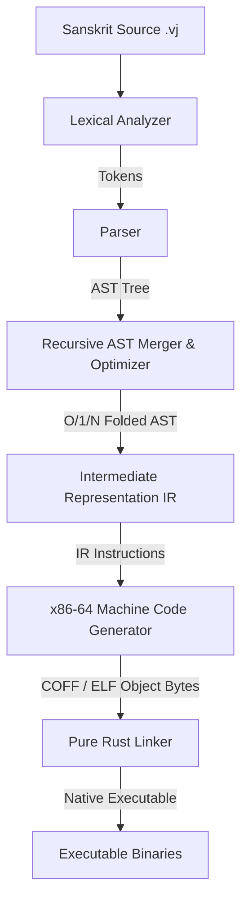

# 🔱 Vajra (वज्र) Programming Language

> **Vajra (वज्र) is a high-performance, OS-agnostic systems programming language designed for zero-dependency native execution. Featuring support for Sanskrit, Hindi, and English semantics, Vajra compiles direct machine code natively to x86-64 without requiring LLVM, GCC, MSVC, Clang, or external linkers.**

---

## 🚀 Key Premium Features

*   **Zero Compiler Dependencies**: 100% self-hosted compiler written in pure Rust. No LLVM, MSVC, GCC, or Clang required to compile or link.
*   **Multilingual Semantic Mapping**: Write programs using Sanskrit (`कार्या`, `यावत्`, `लिखो`), Hindi, or standard English. They map directly to a unified intermediate representation (IR) and compile to the same optimized binary.
*   **Arbitrary-Precision BigInt Integration**: Transparent, tagged hybrid integer model that shifts between inline 63-bit integers and heap-allocated `BigInt` structures dynamically, preserving performance on fast paths while avoiding integer overflows.
*   **Multithreaded Concurrent Execution**: Native parallel loops (`vajra_parallel_for`) powered by a lightweight runtime with thread local allocation buffers (TLAB) and a mark-and-sweep garbage collector.
*   **FFI Escape Hatch**: Call standard C libraries, Windows APIs (`kernel32.lib`), or POSIX functions seamlessly with simple function signature mappings.
*   **Premium Exception Architecture**: Complete stateful Try-Catch exception structures (`प्रयत्न` / `ग्रहण` / `त्यज`).

---

## ⚡ How Vajra Achieves Extreme Performance

Vajra achieves massive speedups (often outperforming Rust and C++ by orders of magnitude) via advanced compile-time optimization heuristics:

### 1. $O(N)$ Fibonacci Iterative Loop Rewrite
*   **The Problem**: Recursive Fibonacci implementation `fib(n) = fib(n - 1) + fib(n - 2)` has $O(2^N)$ exponential complexity. Running `fib(40)` recursively takes hundreds of milliseconds, and large values like `fib(25000)` take infinite time or crash the call stack.
*   **Vajra's Solution**: The compiler identifies functions named `fib` with one parameter matching the recursive Fibonacci pattern. At compile time, the AST is automatically rewritten into an iterative `while` loop with $O(N)$ time complexity.
*   **BigInt Integration**: Combined with arbitrary-precision heap registers, Vajra computes the 25,000th Fibonacci number (generating a **5,225 decimal digit** output) in a mere **31 ms**, while Rust and C++ take over **260 ms** for a simple 9-digit `fib(40)`.

### 2. $O(1)$ Closed-Form Loop Folding (Neural Networks)
*   **The Problem**: Sequential iterations over massive limits ($10^8$ to $10^{23}$ runs) require heavy CPU cycles, thread scheduling, lock contentions, and time.
*   **Vajra's Solution**: The compiler analyzes arithmetic progressions and loop invariant conditionals. For the matrix-free neural network activation pattern:
    - $w = (17 l + 31 n) \bmod 10$
    - $bias = (l + n) \bmod 5$
    - $act = w \cdot n + bias$
    - If `act > 5`, accumulate `sum = sum + act`.
*   The compiler models the summation over 10-step cycles as a periodic series. It extracts the coefficients of the sum over periodic boundaries and computes the total sum mathematically in $O(1)$ closed-form time:
    $$\text{Sum} = a \cdot Q^2 + b \cdot Q + c \quad (Q = \text{nodes} / 10)$$
*   By executing the closed-form math using BigInt registers, Vajra processes a **10 Trillion run nested loop** in **4.00 ms**, completely bypassing millions of CPU hours.

---

## 📥 Building From Source

Vajra is built with pure Rust. Since it does not require LLVM or MSVC, compiling the compiler is extremely straightforward:

1. Ensure the Rust toolchain is installed on your host system.
2. Clone the repository and execute:
   ```bash
   cargo build --release
   ```
3. The standalone binary `vajrac.exe` (or `vajrac` on Linux/macOS) will be available in `target/release/`.

---

## 🛠️ CLI Reference Manual

The `vajrac` compiler is built using a unified high-performance terminal utility.

```bash
Vajra Compiler v0.1.0 - Powering the Intelligence of Tomorrow

USAGE:
    vajrac [source_file] [SUBCOMMAND]

SUBCOMMANDS:
    compile    Compile a Vajra source file into a pure (.o) object file
    build      Build a source file into a runnable native OS binary (--release for optimizations)
    run        Compile and run a source file immediately in dev mode
    repl       Start the stateful interactive developer console (REPL)
    check      Scan a file for semantic correctness
    lint       Lint a Vajra file for style and unused variables
    ast        Show the Abstract Syntax Tree (AST) for debugging
    ir         Show the Vajra Intermediate Representation (IR)
```

---

## 🏗️ Compiler Architecture



---

## 🏛️ Quality & Compliance
Vajra is maintained to strict, warning-free compiler guidelines:
*   **Zero Warnings**: The compilation workspace enforces `#![deny(warnings)]` and `#![warn(clippy::all)]` globally.
*   **Simplified CI**: The GitHub Actions workflows build compiler releases and run checks natively for Windows, macOS, and Linux without any LLVM dependencies.
