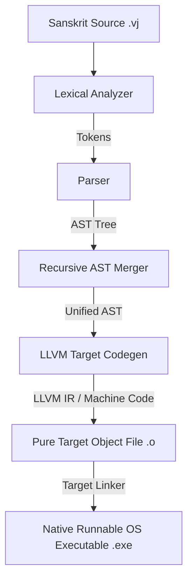

# 🔱 Vajra (वज्र) Programming Language

> **Vajra (वज्र) is the world's first Sanskrit and Hindi-powered, OS-agnostic systems programming language designed for high-performance, self-hosting runtime compilation. Powered by LLVM, Vajra compiles native machine code for the target triple with state-of-the-art memory safety, FFI escape hatches, stateful loops, and OOP method structures.**

---

## 🚀 Key Premium Features

*   **Multilingual Semantic Mapping**: Write programs using Sanskrit (`मुद्रित`, `लेखन`, `mudrit`), Hindi (`लिखो`, `likho`), or standard English. They resolve instantly to the same highly-optimized LLVM code generation node.
*   **AOT Cross-Compilation**: Full target-triple support utilizing LLVM (`-t` / `--target`). Code generated is optimized and packaged directly into OS-agnostic native object binaries (`.o`).
*   **The FFI `@extern` Escape Hatch**: Call standard C libraries, Windows APIs (`kernel32.lib`), or POSIX functions seamlessly with simple function signature mappings.
*   **Recursive Import Resolution (`आयात`)**: Seamless package management system with cyclic import prevention.
*   **First-Class Integer OOP Methods**: Primitive types support dynamic method calls natively (e.g., `5.add(10)` or `10.mul(2)`).
*   **Premium Exception Architecture**: Complete stateful syntax support for Try-Catch exception structures (`प्रयत्न` / `ग्रहण` / `त्यज`).

---

## 📥 Installation & Precompiled Binaries

Vajra provides optimized precompiled compiler binaries for all major platforms. You can download the latest stable toolchain asset directly from the **GitHub Releases** page:

*   **Windows (x64)**: Download [vajrac-windows-x86_64.zip](https://github.com/your-username/vajra/releases), extract `vajrac.exe`, and add it to your system `PATH`.
*   **macOS (Apple Silicon)**: Download [vajrac-macos-aarch64.tar.gz](https://github.com/your-username/vajra/releases), extract the `vajrac` binary, and place it in `/usr/local/bin`.
*   **Linux (x64)**: Download [vajrac-linux-x86_64.tar.gz](https://github.com/your-username/vajra/releases), extract the `vajrac` binary, and place it in `/usr/local/bin`.

### Building From Source
If you wish to compile the compiler manually from source:
1. Ensure LLVM 19 and Rust are installed on your host system.
2. Clone the repository and execute:
   ```bash
   cargo build --release
   ```

---

## 🛠️ CLI Reference Manual

The `vajrac` compiler is built using a unified high-performance terminal utility.

```bash
Vajra Compiler v0.1 - Powering the Intelligence of Tomorrow

USAGE:
    vajrac [source_file] [SUBCOMMAND]

FLAGS:
    -h, --help       Prints help information
    -V, --version    Prints version information

SUBCOMMANDS:
    compile    Compile a Vajra source file into a pure (.o) object file
    build      Build a source file or an existing (.o) object file into a runnable native OS binary
    run        Compile and run a source file immediately in dev mode
    test       Scan a directory and run all Vajra integration test cases
    repl       Start the stateful interactive developer console (REPL)
```

### ⚡ Developer Dev-Mode (Direct Execution)
If you run the compiler with a direct source file argument (without any subcommand), it immediately compiles, builds, and executes your code:
```bash
# Auto-builds and executes app.vj in dev mode instantly!
vajrac app.vj
```

---

## 🌐 Target Compilation Support Matrix

Since Vajra is natively powered by the LLVM machine optimization backend, it natively supports cross-compilation target compilation:

| Target Operating System | Architectures | Target Triple Examples |
| :--- | :--- | :--- |
| **Windows** | `x86_64`, `aarch64` | `x86_64-pc-windows-msvc`, `aarch64-pc-windows-msvc` |
| **Linux** | `amd64`, `arm64`, `mips` | `x86_64-unknown-linux-gnu`, `aarch64-unknown-linux-gnu` |
| **macOS** | `Apple Silicon (M1/M2/M3)`, `Intel` | `aarch64-apple-darwin`, `x86_64-apple-darwin` |
| **Android** | `aarch64`, `armv7` | `aarch64-linux-android` |
| **iOS** | `aarch64` | `aarch64-apple-ios` |

To cross-compile, pass the `--target` / `-t` flag:
```bash
# Compiles a Linux-compatible object binary from Windows!
vajrac compile app.vj -o app.o --target aarch64-unknown-linux-gnu
```

---

## 📝 Syntax Examples

### 1. Cross-Platform FFI Call (`abs` function from stdlib)
```text
# EXPECT: 42

@extern
कार्या abs(n)

@main
कार्या मुख्य() {
    अस्तु ऋणात्मक = 0 - 42
    अस्तु धनात्मक = abs(ऋणात्मक)
    लिखो(धनात्मक)
}
```

### 2. Recursive Imports (`math.vj`)
**`math.vj`**:
```text
कार्या add_one(x) {
    निवर्तय x + 1
}
```

**`app.vj`**:
```text
आयात "math.vj"

@main
कार्या मुख्य() {
    अस्तु अ = 10
    अस्तु ब = add_one(अ)
    लिखो(ब)
}
```

### 3. Try-Catch Exception Handler & Loops
```text
# EXPECT: 3
# EXPECT: 2
# EXPECT: 1
# EXPECT: 888

@main
कार्या मुख्य() {
    अस्तु अ = 3
    यावत् (अ) {
        लिखो(अ)
        अ = अ - 1
    }
    
    प्रयत्न {
        लिखो(888)
    } ग्रहण (त्रुटि) {
        लिखो(999)
    }
}
```

---

## 🏗️ Compiler Architecture



---

## 🏛️ Quality & Strict Compliance
Vajra is maintained to strict, production-level coding guidelines:
*   **Zero Warnings**: The compilation workspace enforces `#![deny(warnings)]` and `#![warn(clippy::all, clippy::pedantic)]` globally.
*   **Fully Tested CI**: A multi-platform GitHub Actions workflow runs continuously on Windows, macOS, and Linux to maintain the highest quality standards.
